# Architecture

Landing Kit is three programs, not one, and they run at three different times. Almost every
question about this repo resolves once you know which of the three you are looking at.

| | What runs | When | Produces |
|---|---|---|---|
| **Scaffold time** | `cli/`, under `pnpm dlx` | once, per new project | a standalone project on disk that no longer depends on this package |
| **Build time** | Vite plus TanStack Start prerendering; optionally `go build` | per deploy | static HTML in `dist/client`, optionally a Go binary with that HTML inside it |
| **Run time** | the browser; optionally the Go service | per visitor | pages, and exactly one JSON exchange |

The site a visitor loads has **no server component at all** unless the optional backend was asked
for. That is the premise the whole repo is arranged around, and it is why "how does this exchange
data with the backend" has such a small answer: one endpoint, one direction, one payload.

## Contents

- [1. The three trees](#1-the-three-trees)
- [2. Scaffold time](#2-scaffold-time)
- [3. Build time](#3-build-time)
- [4. Run time: how a page is delivered](#4-run-time-how-a-page-is-delivered)
- [5. Run time: data exchange with the backend](#5-run-time-data-exchange-with-the-backend)
- [6. The admin read path](#6-the-admin-read-path)
- [7. Data model](#7-data-model)
- [8. Deployment topologies](#8-deployment-topologies)
- [9. Seams that can drift, and what catches them](#9-seams-that-can-drift-and-what-catches-them)
- [10. What deliberately does not exist](#10-what-deliberately-does-not-exist)

## 1. The three trees

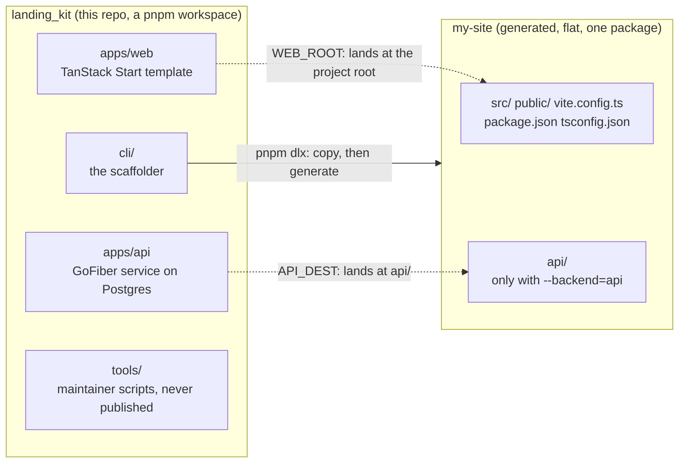

The asymmetry is the thing to hold onto. This repo is a workspace whose packages live under
`apps/`; a generated project is flat, with the web app at the root and the Go service beside it in
`api/`. `WEB_ROOT` and `API_DEST` in `cli/kit-manifest.mjs` are the only two places that know about
that difference, which is what lets `add-block` and `add-page` run without any awareness that a
backend can exist.

## 2. Scaffold time

### The pipeline

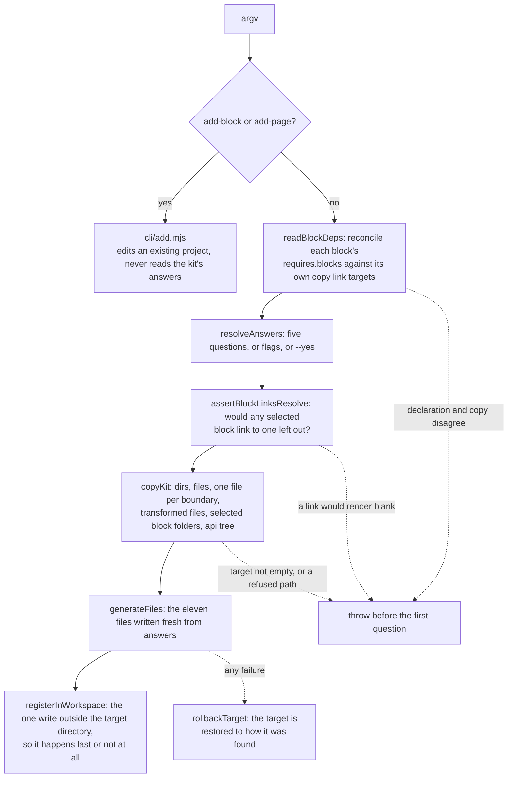

The ordering is load bearing, not stylistic. `readBlockDeps` runs before the first question because
the prompt is about to offer or refuse block combinations on the strength of a declaration that may
have drifted from the copy. `assertBlockLinksResolve` rejects the *answers*, before a directory
exists, so "refuses before anything is written" is literally true rather than made true by the
rollback.

### Copied, transformed, or generated

| Kind | Examples | Why |
|---|---|---|
| Copied verbatim | `src/components`, `src/lib`, `src/routes`, `public`, `scripts` | nothing about them varies by answer |
| Copied, filtered | `src/styles/presets` | only the chosen preset survives |
| Copied, one of two | `@/motion`, `@/theme`, `@/submit` implementations | see the boundary table below |
| Copied, edited | `README.md`, `theme.css`, `biome.json`, `submit-schema.ts`, the docs components | the kit's own copy names things a generated project does not have |
| Generated from answers | `package.json`, `tsconfig.json`, `vite.config.ts`, `registry.ts`, `block-modules.ts`, `variants.all.ts`, `pages.config.ts`, `site.config.ts`, `.gitignore`, `.kit/scaffold.json`, `pnpm-workspace.yaml`, and `docker-compose.yml` with a backend | these encode the answers, so copying them would only mean overwriting them a moment later |
| Refused | `cli`, `docs`, `configs`, `lighthouserc*.json`, and `node_modules` / `dist` / `.kit` / `.git` at any depth | reaching them means the manifest is wrong, and shipping them is worse than stopping |

### The four alias boundaries

Every swappable implementation is a Vite alias resolved at build time, never an `if` inside a
component. That is what lets an unchosen implementation be *absent* rather than merely unused.

| Alias | Kit has | Generated project gets | Chosen by |
|---|---|---|---|
| `@/motion` | `motion.animated.tsx`, `motion.noop.tsx` | always `motion.animated.tsx` | `KIT_ANIMATION`, kit only |
| `@/theme` | `theme.both.tsx`, `theme.single.tsx` | whichever `site.theme.mode` implies | the theme question |
| `@/submit` | `submit.endpoint.ts`, `submit.rpc.ts` | **always** `submit.endpoint.ts` | `KIT_SUBMIT`, kit only |
| `@/config` | `src/config`, `configs/smoke-onepage` | always `src/config` | `KIT_CONFIG`, kit only |

Three of those four never vary in a scaffolded project. `KIT_SUBMIT=server` exists so the RPC
implementation stays real and proven in this repo; it is not a scaffolding option, and
`cli/kit-manifest.mjs`'s `BOUNDARY_FILES.submit` is hardcoded to the endpoint variant.

Because `tsconfig.json` resolves `@/submit` to one file, nothing else type-checks the other. That
is why `submit-schema.ts` declares a `SubmitModule` type and both variants end with a
`const _contract: SubmitModule = { submitContact }` line: it is the only thing keeping the two from
drifting apart.

## 3. Build time

### The web build

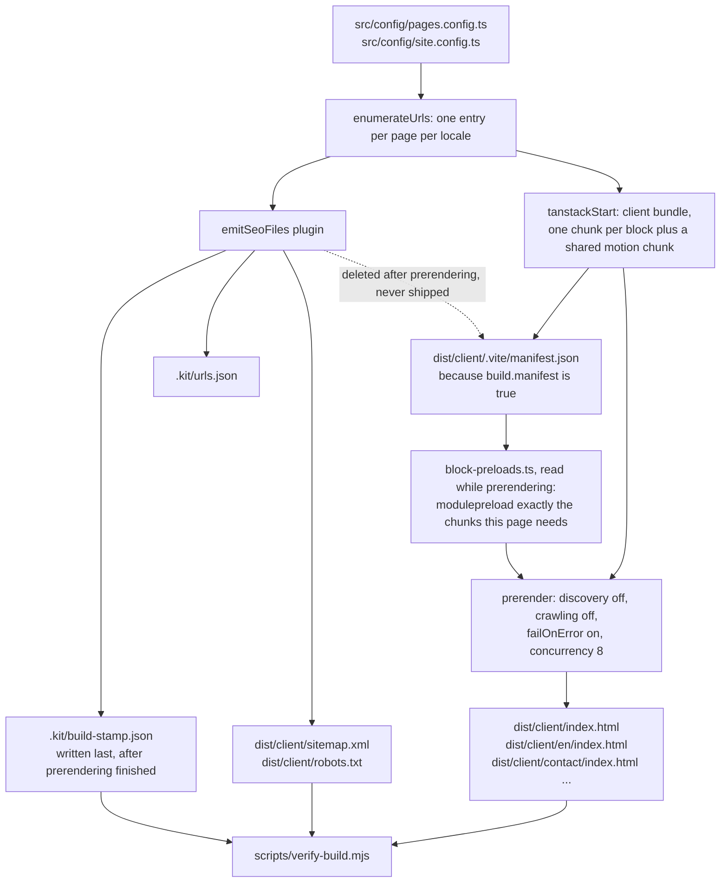

Two details that surprise people:

- **Prerender discovery and link crawling are both off.** That is what keeps `/docs`, which is
  absent from `pages.config.ts`, out of the build. Flip either and it prerenders with no other
  warning anywhere in the source.
- **The build stamp is the last write of the build, and lives outside `outDir`.** A failed build
  does not empty `dist/`, so without the stamp a broken build with a passing verify is a real
  combination. It is not written into `dist/client` because that directory is deployed as the
  public site root.

### Embedding the site into the Go binary

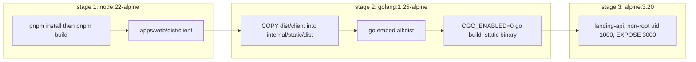

`make build` in `apps/api` does the same thing locally, with one addition worth knowing: it
**wipes** `internal/static/dist` before copying rather than copying over the top. Every built
filename is content hashed, so nothing ever overwrites anything, and `go:embed` has no notion of
"files this build removed". Without the wipe, a stale asset stays embedded forever.

`internal/static/dist/.placeholder` is a committed empty file. `go:embed` is a compile error when
its pattern matches nothing, so without it `go build ./...` fails on a fresh clone before anyone
has run a web build. The `all:` prefix is what makes a dotfile match.

Whether a site was actually embedded is decided at startup by looking for `dist/index.html`, not by
the placeholder's absence, and the static handler is mounted **last and conditionally**:

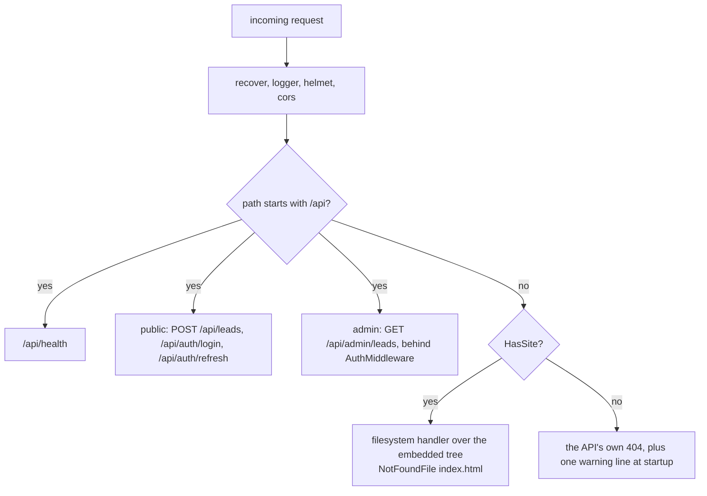

Mounted before the API routes instead of after, the site's catch-all would answer for every
unmatched path, including a mistyped API route. Mounted unconditionally, an API-only binary would
answer every page request with a confusing 404 instead of its own routes.

## 4. Run time: how a page is delivered

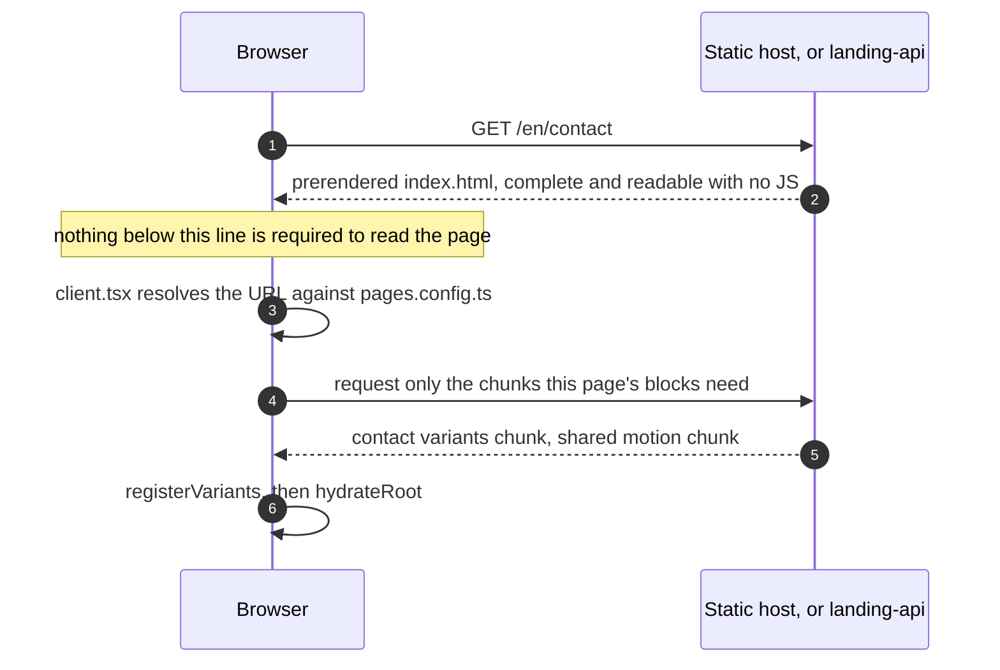

The block components are the weight, so `registry.ts` loads manifests eagerly (the head and JSON-LD
need copy, nav and schema immediately) while `block-modules.ts` loads components as one dynamic
import per block. Contact alone is roughly 99 KB raw of `react-hook-form` and `zod`.

Chunks are awaited **before** hydrating, never through `React.lazy`, because lazy suspends during
hydration and React then throws away the server-rendered HTML. That was measured as CLS 0.000
becoming 0.169.

This loading happens once, for the first URL only. Nothing re-runs it, which is safe only because
every link in the template is a plain `<a href>` full page load. A `@tanstack/react-router` `Link`
would navigate to a page whose block chunks were never fetched, so `check-conventions.mjs` fails the
build on any such import inside `src/blocks`, `src/components` or `src/routes`.

If a chunk fails to load, hydration is **deliberately skipped**: the static page stays on screen and
readable, and one console error names every block that failed. A missing block module would make
`getVariants` throw during hydration, and React's retry leaves a blank page.

## 5. Run time: data exchange with the backend

This is the whole of it. One endpoint, one direction, fire and forget.

### The submit boundary, both modes

| | `submit.endpoint.ts` (every scaffolded project) | `submit.rpc.ts` (`KIT_SUBMIT=server`, kit only) |
|---|---|---|
| Transport | `fetch` to `import.meta.env.VITE_CONTACT_ENDPOINT` | TanStack Start `createServerFn`, POST |
| Origin | cross-origin, so **CORS applies** | same origin |
| Needs | any HTTP receiver | a Node server at runtime, so no purely static deploy |
| Wire shape | `snake_case`, matching the Go JSON tags | the `SubmissionInput` object as-is |
| Revalidation | by the receiving service | by the server function's `.validator` |
| Delivery | whatever the endpoint does | logs, with a mail provider left to be wired in |

Unset `VITE_CONTACT_ENDPOINT` is the single most common cause of a form that appears to do nothing:
it returns `missing-endpoint` and the block shows its generic error copy.

### Endpoint mode, end to end

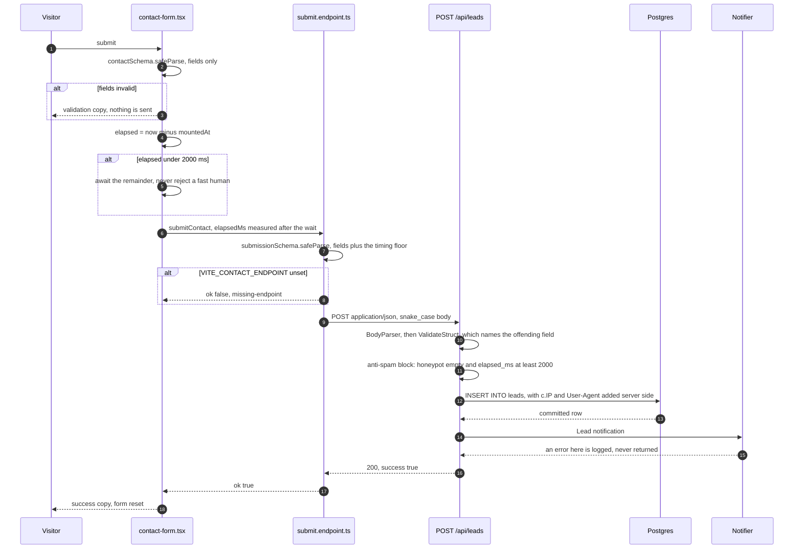

Two ordering decisions in there are the interesting ones.

**Field validation and the timing check are separate, on both sides.** One combined schema would
tell a fast but real human (autofill, a password manager) that their correct fields are wrong, which
blames the wrong thing and loses the lead. The client waits out the remainder instead; a bot will
not stay for the promise.

**Store, then notify, and never fail the request on a notification error.** The row is already
committed by the time the notifier runs, so returning that error would tell a real visitor their
message did not arrive when it did. A mail outage must not look like a broken form.

### Field mapping, client to column

| Form field | Client validation | Wire field | Go field and tag | Stored as |
|---|---|---|---|---|
| `name` | 2 to 120 chars | `name` | `Name`, `required,min=2,max=120` | `leads.name` |
| `email` | zod email | `email` | `Email`, `required,email` | `leads.email` |
| `message` | 10 to 4000 chars | `message` | `Message`, `required,min=10,max=4000` | `leads.message` |
| `honeypot_url` | must be empty | `honeypot_url` | `HoneypotURL`, `validate:"-"` | not stored |
| computed | integer, at least 2000 | `elapsed_ms` | `ElapsedMs`, `validate:"-"` | not stored |
| from `document.documentElement.lang` | none | `locale` | `Locale`, `omitempty,oneof=mn en` | `leads.locale`, empty becomes `mn` |
| from `window.location.pathname` | none | `source_page` | `SourcePage`, `omitempty,max=200` | `leads.source_page` |
| not sent | | | `c.IP()` | `leads.ip`, NULL when unparseable |
| not sent | | | `c.Get("User-Agent")` | `leads.user_agent` |

`honeypot_url` and `elapsed_ms` carry `validate:"-"` on purpose rather than a real tag. A tag would
let the general validator reject them first, on its own path, with its own message, and a message
distinguishable from the anti-spam block's tells a bot author exactly which check tripped. Both
fields are policed only by that block, which shares one string for both outcomes.

`ip` is a `*netip.Addr` and the nil check is load bearing. Postgres rejects an empty string bound to
an `inet` column with SQLSTATE 22P02, and Fiber's `c.IP()` returns `""` whenever `PROXY_HEADER`
names a header that does not arrive. Passing it straight through would turn every submission behind
a misconfigured proxy into a 500.

### Spam defences, and which side each one runs on

| Check | Client | Server | Note |
|---|---|---|---|
| Honeypot field empty | yes | yes | field is named `honeypot_url`, not something plausible like `company`, because autofill fills recognised names even with `autoComplete="off"`, and a filled honeypot rejects a real person |
| 2000 ms minimum on screen | yes, by waiting | yes, by rejecting | `elapsedMs` is a required part of the payload precisely so this check is not client only |
| Rate limit, 5 per 10 minutes | no | yes | keyed per client IP; an unresolvable IP gets a fresh UUID key, so one request goes unlimited rather than joining a shared bucket |

Everything on the client runs on a client a bot simply skips: it can POST straight at the endpoint
and never load the form. The server-side recheck is the only version of either check that cannot be
walked around.

The rate limiter's failure mode is worth spelling out, because the obvious implementation is worse
than none. If `c.IP()` returns `""` and that empty string is used as the bucket key, every caller
collapses into **one** bucket: on a public contact form a single spammer locks out every real
visitor, and on a login endpoint one attacker's guesses lock out every admin.

### Responses

| Status | Body | Sent when |
|---|---|---|
| 200 | `{"success": true}` | stored, whether or not the notification succeeded |
| 400 | `{"error": "validation error", "message": "..."}` | malformed body, a field-shape failure (named), or either anti-spam check (generic, indistinguishable) |
| 429 | `{"error": "rate limited", "message": "..."}` | limiter tripped |
| 500 | `{"error": "internal error", "message": "..."}` | the insert failed |

The client reads `res.ok` and nothing else. It maps failure to `http-<status>` or `network`, and the
block renders its own localised copy, so the API's Mongolian `message` strings are never displayed
by this frontend. They exist for an operator and for any other client.

### Notification

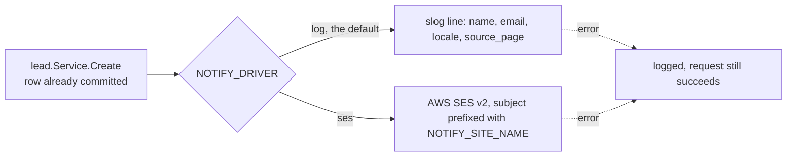

The message body is deliberately **not** logged. It is visitor-submitted free text, and logs are the
one place it would be copied to that nobody audits.

Startup refuses `NOTIFY_DRIVER=log` when `APP_ENV=production`, because that combination stores every
lead and tells nobody, with no error anywhere. `ses` additionally requires `NOTIFY_TO` and
`SES_FROM` at the config boundary, for the same reason: since a notification error can never fail a
request, a deploy missing either would boot cleanly, report `driver=ses`, and notify nobody from the
first lead onward.

`AWS_REGION` is deliberately not required alongside them: it has a legitimate ambient source (an
instance profile's resolved region) that the other two do not.

## 6. The admin read path

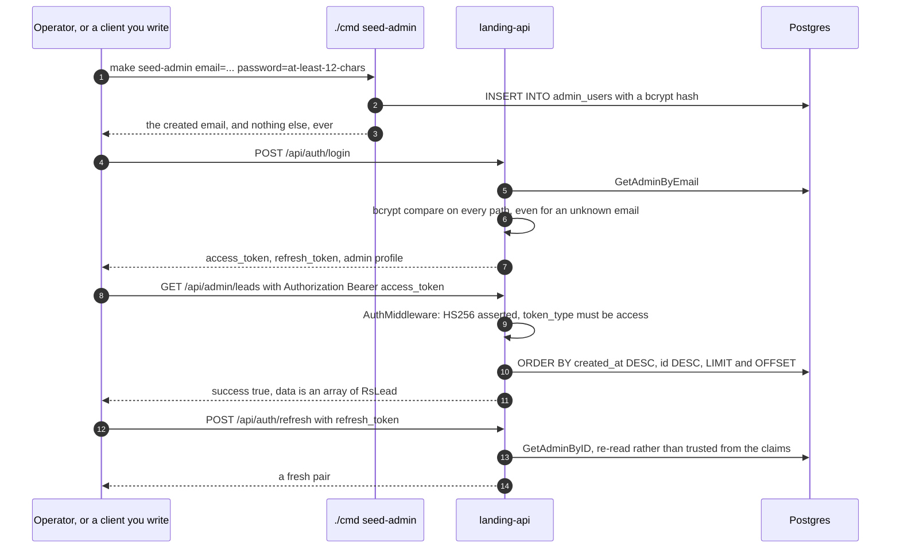

| Endpoint | Auth | Limits |
|---|---|---|
| `POST /api/auth/login` | none | 5 per 15 minutes per client |
| `POST /api/auth/refresh` | the refresh token itself | 5 per 15 minutes per client |
| `GET /api/admin/leads` | `Authorization: Bearer <access token>` | `limit` defaults to 50, clamped to 200; `offset` clamped to `MaxInt32` before the int32 conversion |

Four properties of this path are deliberate and easy to undo by accident:

- **Unknown email and wrong password are the same error**, and the unknown-email branch still runs
  bcrypt against a fixed dummy hash. The identical message alone is not enough: bcrypt is
  deliberately slow, so a path that skips it returns measurably sooner, and that gap enumerates
  valid emails without ever showing a different message.
- **Access and refresh tokens are not interchangeable.** `token_type` is read back out of the claims
  on every validation, because a refresh token accepted where an access token belongs silently
  extends the session from one hour to seven days.
- **The signing method is asserted in the keyfunc**, not assumed. `jwt.Parse` runs the keyfunc
  before verifying the signature, so a keyfunc that returns the secret unconditionally accepts
  anything the library can parse.
- **Refresh re-reads the admin row.** An admin removed after a refresh token was issued cannot use
  it to obtain a new access token, and "token malformed" and "admin was deleted" collapse to the
  same 401.

`JWT_SECRET` has a development-only default and **no** default anywhere else: startup refuses an
empty or shorter-than-32-character secret whenever `APP_ENV` is not `development`. The same
asymmetry applies to `CORS_ORIGINS`, whose development default is refused outside development,
because a deploy that forgets it boots cleanly, answers `/api/health` with 200, and drops every real
submission at preflight with no server-side log line at all.

## 7. Data model

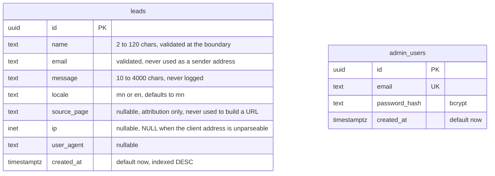

No foreign key joins the two, because nothing relates them: an admin reads leads, an admin does not
own them.

`leads_created_at_idx` exists because the admin list is newest-first and is the only read path;
without it that list is a sequential scan plus a sort, invisible at 10 rows and not at 100,000. The
`id DESC` tiebreaker in `ListLeads` is not decoration either: `created_at` alone is not a total
order, two rows can share a timestamp under concurrent inserts, and `LIMIT`/`OFFSET` paging over a
non-total order can show one lead twice or skip another.

Migrations are embedded and run automatically at startup, before the pool is opened. The sqlc output
under `internal/db/sqlc` is committed so a scaffolded project builds without anyone installing sqlc
first, and `pnpm api:sqlc` runs `sqlc diff`, which fails on both a hand-edit and a forgotten
regeneration. It needs no database, because it reads the migration files as its schema.

## 8. Deployment topologies

### A. Static only, `--backend=none`

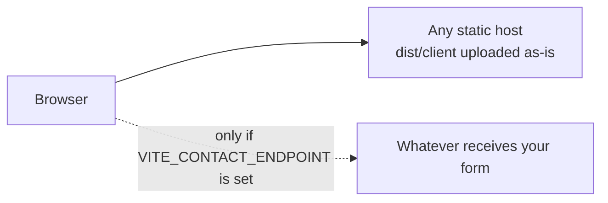

Nothing to run, nothing to operate. The contact form needs an external receiver that accepts the
JSON body above and rechecks the honeypot and the timing floor.

### B. Local development with the backend, two origins

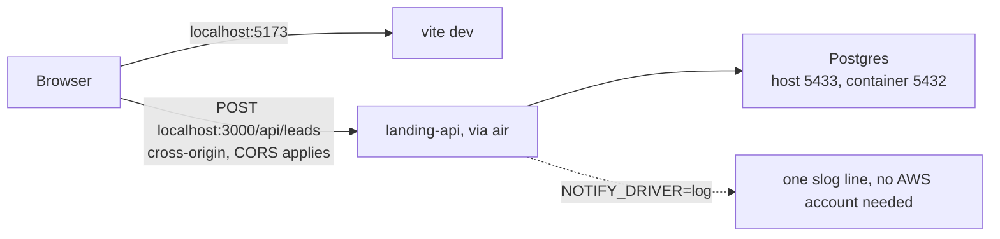

This is the only topology where CORS is in the path, which is why "if the contact form silently
fails, check CORS first" is one of the gotchas the web README calls out: a preflight rejection
surfaces as exactly the same generic error a real code bug would.

The host port is 5433, not 5432, because a developer machine very often already runs Postgres, and
binding 5432 makes `docker compose up -d db` fail with "port is already allocated" on a fresh clone.
`conf.defaultDBPort` matches it deliberately: a default of 5432 with no compose service running
would connect to whatever Postgres is already there, which is a silently wrong database, where 5433
is a connection refused that says what is wrong.

### C. One container, one origin

In plain terms: one program, one port, two kinds of answer.

**At build time** the frontend build produces a folder of finished HTML files, one per page, plus the
JS and CSS. That folder is copied next to the Go code, and `go build` bakes it into the binary as
data. The executable becomes a zip file with a program attached: the site is part of the program.

**At run time** the binary listens on 3000 and checks every request against the routes in
registration order. A path starting with `/api` runs a Go handler and talks to Postgres. Anything
else is looked up as a file in the baked-in tree, and a path matching no file gets the root
`index.html` so the client router can render Not Found. The diagram under
[Embedding the site into the Go binary](#embedding-the-site-into-the-go-binary) is that decision in
full.

**Go is the web server.** No nginx, no Node, no separate application server: the final image stage
installs `ca-certificates` and `tzdata` and nothing else. Fiber's `filesystem` middleware does the
job nginx would, reading from `embed.FS` in memory rather than from a directory on disk. And it
serves finished files. The HTML was rendered by the prerenderer at build time, so nothing is
templated, no React runs on the server and no query is made to build a page; the Go handlers only do
work for `/api/*`.

Two things this container does **not** do: TLS termination and response compression. Both belong to
whatever sits in front of it, which is the shape the image is built for: one plain-HTTP port, no
config files, non-root, the binary as `CMD`.

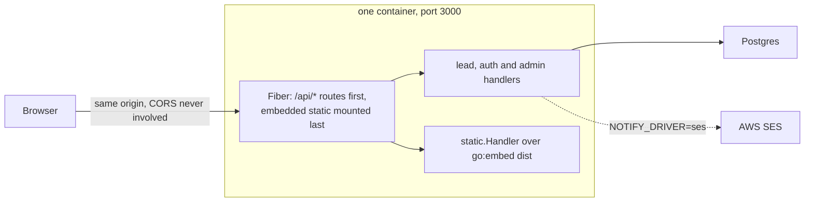

This is what `docker build .` at this repo's root produces, and what `make build` plus running the
binary produces locally. A request from the served site to its own `/api/leads` never goes through
CORS at all.

Two things not to undo here: `helmet`'s `CrossOriginEmbedderPolicy` and `CrossOriginResourcePolicy`
are relaxed to the browser's own defaults, because the library defaults (`require-corp` and
`same-origin`) silently break every cross-origin subresource the site loads, with no server-side
signal whatsoever.

Note that the **generated** project's `docker-compose.yml` has a `db` service only. The
Dockerfile above is written for this repo's layout, `apps/web` beside `apps/api`; a generated
project is flat with the service in `api/`, so the kit's Dockerfile does not apply and the
scaffolder does not yet produce one for that shape.

## 9. Seams that can drift, and what catches them

Anything duplicated across a boundary is a drift risk. These are the duplications in the tree, and
the third column is the part worth knowing.

| Duplicated value | Copies | What catches drift |
|---|---|---|
| The 2000 ms timing floor | `MIN_ELAPSED_MS` in `submit-schema.ts`, `models.MinElapsedMS` in Go | the integration test in `internal/http/handlers/lead/lead_test.go`, and nothing else |
| Block dependencies | `requires.blocks` in each `block.ts`, the `target`s in each `copy.ts` | `readBlockDeps`, before the CLI's first question |
| Page SEO copy | `PAGE_SEO` in `cli/generate.mjs`, the kit's `pages.config.ts` | `assertSeoCopyMatchesKit` at generate time |
| Compiler options | `apps/web/tsconfig.json`, `tsconfigJson` in the CLI | `assertTsconfigMatchesKit`, compared semantically |
| pnpm settings | `pnpm-workspace.yaml`, `pnpmWorkspaceYaml` in the CLI | byte comparison after stripping the `packages:` key |
| Compose file | root `docker-compose.yml`, `dockerComposeYml` in the CLI | `assertDockerComposeMatchesKit`, only when the kit's copy is on disk |
| Dependency versions | the kit's `package.json`, a generated project's | versions are read from the kit manifest; only the *grouping* is listed, and an unclassified package is an error |
| Generated SQL code | `internal/db/sqlc`, `internal/db/migrations` | `sqlc diff` via `pnpm api:sqlc` |
| The build output directory | `OUT_DIR` in `out-dir.ts`, versus the default `tanstackStart` really writes to | `verify-build.mjs` |
| Site name | `site.config.ts`'s `name`, `NOTIFY_SITE_NAME` | nothing, by design: the API is a separate process and cannot read a TypeScript file |
| DB port 5433 | `conf.defaultDBPort`, the compose host port, `.env.example` | nothing automated; the comments cross-reference each other |
| The `@/submit` surface | `submit.endpoint.ts`, `submit.rpc.ts` | the `SubmitModule` contract line at the bottom of each |

Three of those checks compare against files that **do not exist under `pnpm dlx`** at all:
`tsconfig.json`, `pnpm-workspace.yaml` and `docker-compose.yml` are none of them in
`package.json`'s `files`. Each guards on `existsSync` and therefore runs only when the kit's own
working copy is present, which is exactly where someone would be editing them. The other checks
read `apps/web/src`, which the tarball does carry, so they run on every scaffold.

## 10. What deliberately does not exist

Useful to know before going looking for it.

- **No admin UI.** `GET /api/admin/leads` is the read path; nothing in `apps/web` calls it, and no
  page or route in the template mentions an admin. Bring your own client, or curl.
- **No server runtime in a default build.** `src/app/server.ts` exists for prerendering; the shipped
  artifact is static files. RPC submit mode would change that, and it is not a scaffolding option.
- **No client-side navigation.** Every link is a plain `<a href>`. Full page loads are cheap when
  every page is static HTML, and the alternative would land on a page whose block chunks were never
  fetched.
- **No CMS.** The marketing pages are prerendered at build time and the Go service never touches
  them. Content changes are code changes.
- **No global rate limiter.** The three public routes carry their own, because each needs a key
  generator that cannot collapse callers into one bucket.
- **No `api` service in a generated `docker-compose.yml`.** See topology C above.
